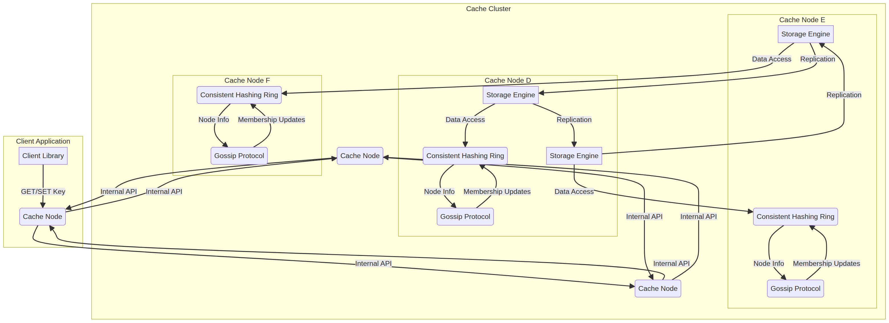
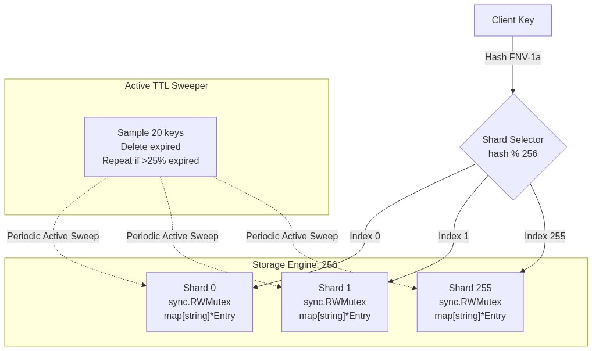
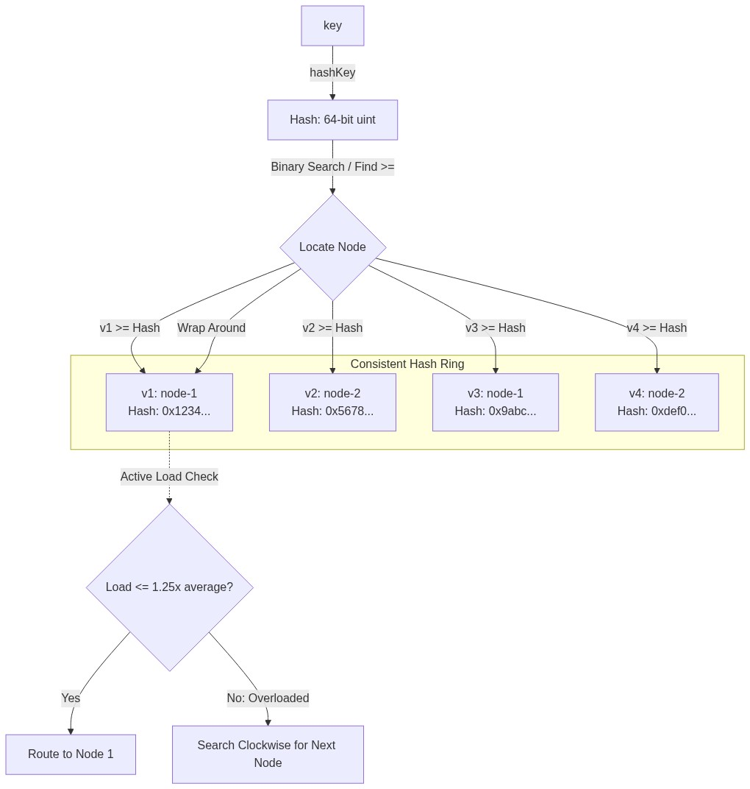
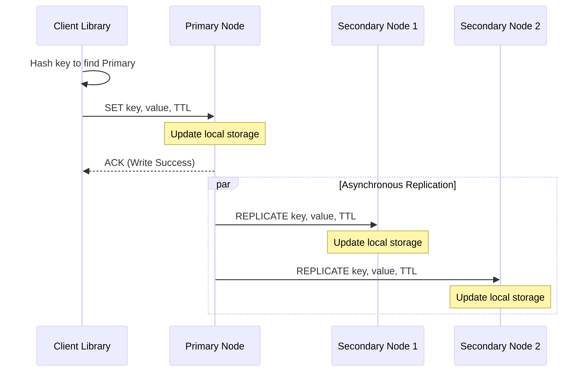
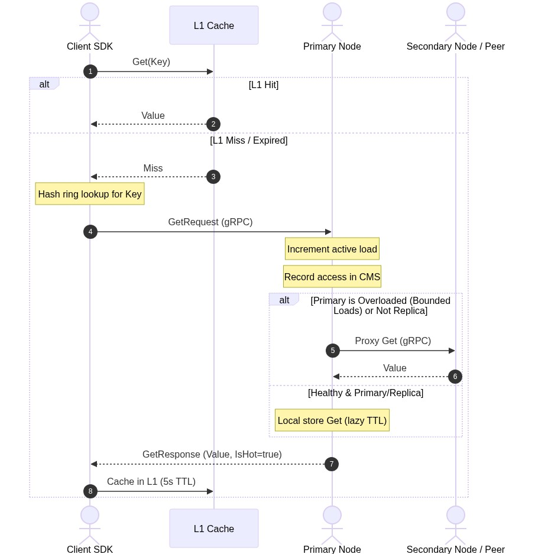
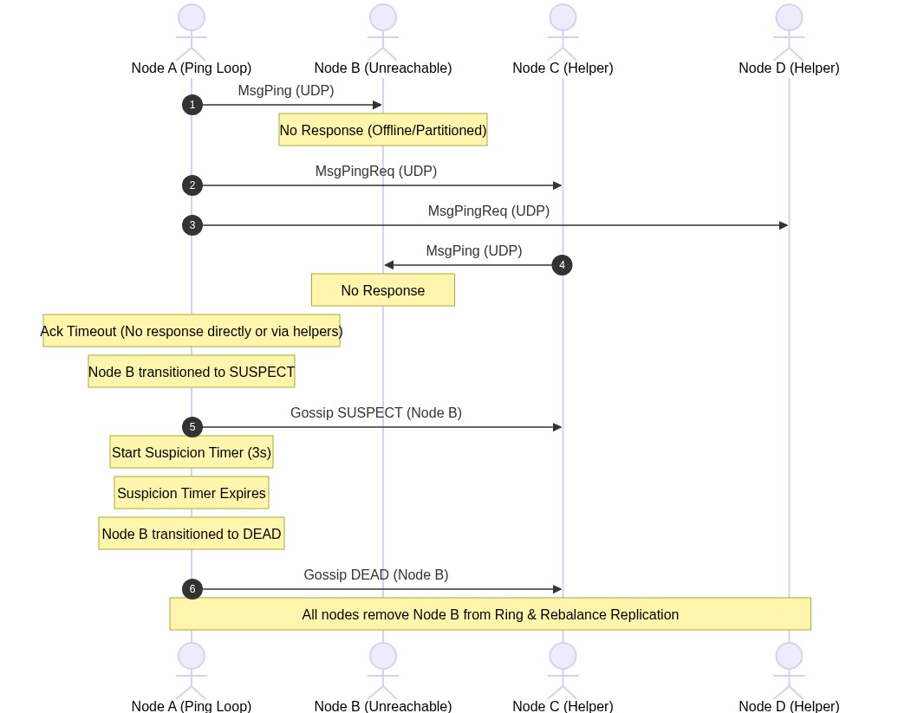

# Consistent Hashing-Based Distributed Cache: End-to-End Architectural Guide

A self-hosted, ultra-high-performance, sharded in-memory distributed key-value store built in Go. This system is designed for massive scale and extreme resilience, featuring consistent hashing with bounded loads, decentralized SWIM-based cluster membership, asynchronous primary-secondary replication, real-time probabilistic hot-key detection (via Count-Min Sketches), key splitting, client-side L1 LRU caching, and a built-in HTTP chaos engineering framework.

---

## 📐 Overall System Architecture

This project is structured as a collection of independent, peer-to-peer cache nodes that self-organize into a cluster. The architecture ensures there is no single point of failure (SPOF) and no centralized coordination bottleneck.

Below is the high-level architecture diagram showing how the components fit together:



### Core Components Interactions
1. **Client Space**: The client SDK acts as a smart router. It holds a local view of the consistent hash ring. When making a request, it hashes the key to find the responsible primary node and routes the query directly via gRPC. It also implements a local **L1 LRU cache** to intercept requests to keys flagged as "hot" by the cluster.
2. **gRPC Interface**: Serves as the high-throughput communication portal for the node, handling both client-facing queries (`Get`, `Set`, `Delete`, `Expire`, `Ping`) and internal cluster operations (`Replicate`, `TransferKeys`).
3. **Consistent Hash Ring (Bounded Loads)**: Serves as the topology registry on both the client and server side. It maps virtual nodes onto a 64-bit hash space and dynamically routes requests, using Google's Bounded Loads algorithm to redirect traffic clockwise if the primary node is overloaded.
4. **Storage Engine**: A highly concurrent, sharded in-memory key-value store with lazy and active background TTL (Time-To-Live) evictions.
5. **Replication Manager**: Tracks replica sets and manages async write propagation from the primary node to secondaries. In case of node failure, it Promotes secondaries to primaries, orchestrating a streaming key synchronization process.
6. **SWIM Gossip Protocol**: Runs over UDP, periodically pinging randomized nodes to maintain cluster membership, disseminate state changes, and update the hash ring.
7. **Hot Key Detector**: Leverages a Count-Min Sketch to identify high-frequency keys probabilistically with extremely low memory overhead.
8. **Mitigation Engine**: Handles key sharding (splitting a single hot key into multiple keys like `key:shard_x`) to disperse read loads.

---

## 🔍 In-Depth Component Walkthrough

### 1. The Storage Engine & TTL Sweeper



#### Internal Sharding
To prevent Global Lock Contention, the store partitions the keyspace into **256 distinct shards**.
- **Hashing**: A key's target shard is computed using the FNV-1a hash algorithm:
  $$\text{Shard Index} = \text{fnv1a}(\text{key}) \% 256$$
- **Concurrency**: Each shard contains its own `sync.RWMutex` protecting its underlying `map[string]*Entry`. This design permits concurrent read/write access across different shards, ensuring high-throughput under parallel client requests.
- **Entry Structure**: Each entry stores the byte-payload value, creation timestamp, and an expiration timestamp (`ExpiresAt`).

#### Hybrid TTL Expiration
Stale memory reclamation is performed via a hybrid lazy-and-active scheme:
- **Lazy Expiration (On-Demand)**: When a `Get` operation targets a key, the store checks `ExpiresAt`. If the timestamp is in the past, the entry is deleted immediately, and a cache-miss (`found = false`) is returned.
- **Active Expiration (Background)**: A background sweeper thread runs periodically (every 100ms by default) cycling through one shard at a time:
  1. It randomly samples **20 keys** from the active shard.
  2. It deletes any keys that are expired.
  3. If **more than 25%** (5 keys) of the sampled set are found to be expired, the sweeper immediately repeats the process on the same shard without waiting for the next tick, rapidly reclaiming memory during bulk expiry events.

---

### 2. Consistent Hashing with Bounded Loads

Consistent hashing distributes keys across a dynamic number of physical servers while minimizing data migration when nodes join or leave.



#### Virtual Nodes (VNodes)
To prevent statistical imbalance (skewed load on specific nodes), each physical node is mapped to **150 virtual nodes** (VNodes) distributed randomly on the ring.
- A VNode's location is determined by:
  $$\text{Hash} = \text{fnv1a}(\text{NodeID} + \text{"\#"} + \text{strconv.Itoa(VNodeIndex)})$$
- The ring is implemented as a sorted slice of VNodes. Binary search ($O(\log(\text{nodes} \times 150))$) resolves key lookups by locating the first VNode hash greater than or equal to the key's hash.

#### Google's Bounded Loads Algorithm
Standard consistent hashing can lead to hot-spotting if a single key or hash range receives sudden high volume. This system implements **Consistent Hashing with Bounded Loads**:
- **Metric**: Each physical node tracks its active concurrent requests via an atomic counter (`loads[NodeID]`).
- **Load Limit**: The ring computes the average load of all active nodes. A node is considered overloaded if:
  $$\text{Node Load} > (1 + \epsilon) \times \text{Average Load}$$
  Where $\epsilon$ is a configurable factor (default `0.25`, capping max load at 125% of the cluster average).
- **Redirection**: During lookup, if the primary target node is overloaded, the lookup algorithm moves **clockwise** on the ring, testing subsequent VNodes until it locates a node with load within the permitted limit.

---

### 3. The SWIM Gossip Protocol & Cluster Membership

For decentralized, coordinate-free cluster management, the system implements the **SWIM (Scalable Weakly-consistent Infection-style Process Group Membership Protocol)**.

```
       SWIM Ping-Ack & Ping-Req Protocol
      ┌─────────────────────────────────┐
      │             Node A              │
      └──────┬───────────────────▲──────┘
             │ 1. Direct Ping    │ 2. Ack
             │    (UDP)          │    (UDP)
             ▼                   │
      ┌──────────┐               │
      │  Node B  │ (Unresponsive)│
      └──────────┘               │
             ▲                   │
             │ 3. Ping-Req       │ 5. Proxy Ack
             │    (UDP)          │    (UDP)
      ┌──────┴───┐               │
      │  Node C  ├───────────────┘
      └──────────┘  4. Indirect Ping (UDP) ──► Node B
```

#### Failure Detection Cycle
Every node runs a periodic failure detection loop (default 500ms):
1. **Direct Probe**: The node sends a `MsgPing` UDP packet containing its current incarnation counter to a randomly selected peer.
2. **Indirect Probe (Ping-Req)**: If the target node does not return a `MsgAck` within a specified timeout (default 200ms):
   - The node selects $K$ random helper nodes (default `3`) and transmits a `MsgPingReq` packet.
   - These helpers attempt to ping the target node directly on behalf of the originating node.
   - If any helper successfully receives an Ack from the target, it relays the Ack back to the initiator.
3. **Suspicion State**: If both direct and indirect probes fail, the initiator transitions the target node's state to `SUSPECT` in the registry and starts a suspicion timer (default 3 seconds).
4. **Dead Declaration**: If the suspected node does not refute the suspicion (by broadcasting an `ALIVE` update with a higher incarnation) before the suspicion timer expires, it is marked as `DEAD` and removed from the consistent hash ring.

#### Gossip Dissemination & Refutation
- **Piggybacking**: Membership updates (`JOIN`, `ALIVE`, `SUSPECT`, `DEAD`, `LEFT`) are queued and appended (up to 10 updates) to outgoing `MsgPing` and `MsgAck` UDP packets, spreading infection-style across the cluster.
- **Incarnation Counter**: Used to refute false-positive failure detections. If Node A receives a gossip update stating that it is `SUSPECT` or `DEAD` (e.g., due to a temporary network partition), Node A increments its own incarnation counter and broadcasts an `ALIVE` update, overriding the stale failure reports.

---

### 4. Replication, Failover & Key Synchronization

To guarantee durability, keys are replicated across $N$ nodes.

#### Asynchronous Replication Write Path
Writes propagate from client to primary, then asynchronously to secondaries:
1. The client looks up the key's primary node on the hash ring and sends a `Set` request.
2. The primary node writes the key-value pair to its local sharded storage.
3. The primary node increments its atomic sequence counter and spawns concurrent goroutines to propagate a `Replicate` gRPC request containing the payload, sequence ID, and TTL to the $N-1$ secondary nodes in the key's replica set.
4. The primary returns success to the client immediately without blocking on secondary confirmations (ensuring ultra-low write latency).

#### Failover & Streaming Re-Replication
When the SWIM protocol detects that a node is `DEAD` and removes it from the ring:
1. **Primary Promotion**: If the dead node was a primary for a set of keys, the next live replica in the hash ring automatically assumes the primary role.
2. **Re-Replication Trigger**: The newly promoted primary detects that the replication factor has fallen below $N$ for those keys. It scans its local store and asynchronously replicates keys to the new secondary node introduced in the updated hash ring.
3. **Streaming Key Synchronization**: When a node is promoted or joins, it can call a streaming `TransferKeys` gRPC RPC on the remaining cluster nodes. The remote nodes iterate through their sharded store and stream matching keys back to the caller over a gRPC stream.

---

### 5. Probabilistic Hot Key Detection & Mitigation

To prevent cluster instability under extreme read traffic targeting a single key (the "Slashdot effect"), the system employs real-time mitigation.

```
                 Count-Min Sketch (4 x 4096)
               ┌───┬───┬───┬───┬───┬───┬───┐
      Hash 1 ──►   │ 1 │   │   │   │   │   │
               ├───┼───┼───┼───┼───┼───┼───┤
      Hash 2 ──►   │   │   │ 3 │   │   │   │
               ├───┼───┼───┼───┼───┼───┼───┤
      Hash 3 ──►   │   │ 2 │   │   │   │   │
               ├───┼───┼───┼───┼───┼───┼───┤
      Hash 4 ──►   │ 1 │   │   │   │   │   │
               └───┴───┴───┴───┴───┴───┴───┘
                Estimate = Min(1, 3, 2, 1) = 1
```

#### Count-Min Sketch (CMS) Detector
On every `Get` request, the server records the key access in a Count-Min Sketch:
- **Structure**: A 2D array of counters with $d=4$ rows (hash functions) and $w=4096$ columns.
- **Update**: For a key, it computes 4 independent hashes and increments the corresponding counter in each row:
  $$\text{Counter}_{i} = \text{hash}_{i}(\text{key}) \% 4096$$
- **Query**: The frequency estimate is the minimum of the 4 counters:
  $$\text{Estimate} = \min_{0 \le i < 4}(\text{Table}[i][\text{hash}_{i}(\text{key}) \% 4096])$$
  This guarantees that we never underestimate frequency, with bounded overestimation error.
- **Decay Loop**: To adapt to changing access patterns, a background thread runs every 60 seconds and halves all counters in the sketch, preventing historic hot keys from permanently triggering mitigations.

#### Mitigation Strategy 1: Key Splitting
If the frequency estimate of a key exceeds the hot key threshold:
1. **Splitting Activation**: The server marks the key as mitigated via `KEY_SPLIT` and creates $S$ sharded copies of the key (default `4` shards) named `key:shard_0` through `key:shard_3` in the local store.
2. **Replication**: The primary writes the original value across all $S$ shards.
3. **Routing**: On subsequent writes to the hot key, the primary writes to all $S$ shards. On reads, the client SDK hashes its own client ID to route requests to a specific shard:
  $$\text{Target Key} = \text{key} + \text{":shard\_"} + (\text{hash(ClientID)} \% S)$$
  This splits the read load across different shards, distributing the queries.

#### Mitigation Strategy 2: Client L1 LRU Cache
- **IsHot Flag**: When a node processes a `Get` request and estimates that a key is hot, it sets `IsHot = true` in the `GetResponse` payload.
- **Client Cache**: The Client SDK features a built-in LRU cache. Upon receiving the `IsHot = true` flag, it caches the key-value pair locally in its L1 cache.
- **Eviction**: Subsequent reads from the client intercept at the L1 layer, bypassing the network hop entirely. L1 entries are managed via LRU eviction and carry a short default TTL (e.g., 5 seconds) to ensure eventual consistency.

---

## 🔄 End-to-End Communication Flows

The diagrams below demonstrate how components communicate during read, write, and failure scenarios.

### 1. Write (`SET`) Operation Flow

The sequence diagram below displays the path of a `SET` request from the client SDK to the cluster:



#### Sequence Steps
1. **L1 Invalidation**: The Client SDK checks if the key exists in its local L1 cache. If present, it deletes the entry to prevent stale reads.
2. **Ring Lookup**: The Client SDK queries its local consistent hash ring to find the primary node responsible for the key.
3. **RPC Execution**: The Client sends a `SetRequest` to the primary node via gRPC, utilizing a custom JSON codec.
4. **Primary Validation & Split check**: The primary node receives the write.
   - If the node is *not* the primary for the key (due to a stale client ring map), it proxies the request to the correct primary.
   - If the key is currently mitigated via Key Splitting, the primary writes the value to the original key *and* all $S$ split shards.
   - Otherwise, it writes only to the original key in the local sharded map.
5. **Async Replication**: The primary returns a successful `SetResponse` to the client. Simultaneously, it triggers async goroutines to call the `Replicate` RPC on the secondary replicas, propagating the data.

---

### 2. Read (`GET`) Operation Flow



#### Sequence Steps
1. **L1 Check**: The client checks its L1 LRU Cache. On a hit, the value is returned immediately.
2. **Ring Lookup**: On a miss, the client queries the hash ring to locate the primary node.
3. **Overload Check**: The gRPC server increments the active request counter for the node.
   - If the target node is overloaded, it delegates the request to the next node in the ring.
   - If the node is not in the replica set for the key, it proxies the request to the correct node.
4. **CMS Increment**: The server updates the Count-Min Sketch, estimating the key's frequency.
5. **Local Read**: The server performs a read on the local sharded map (lazy checking the TTL).
6. **Mitigation Check**: If the estimated frequency exceeds the threshold and mitigation is not active, the server triggers Key Splitting. If already split, the server reads the value from the shard corresponding to the hashed client ID.
7. **Response & Promotion**: The server returns the payload to the client. If the key is hot, it includes `IsHot = true`. The client SDK then stores the value in its L1 cache.

---

### 3. SWIM Failure Detection & Self-Healing Flow



#### Sequence Steps
1. **UDP Ping**: Node A selects Node B and sends a `MsgPing`. Node B is dead or partitioned and does not reply.
2. **Ping-Req Routing**: Node A sends `MsgPingReq` to Node C and Node D, asking them to probe Node B.
3. **Indirect Probing**: Node C and Node D send UDP pings to Node B. Neither receives an answer.
4. **Suspicion Entry**: Having received no Acks within the timeout, Node A marks Node B as `SUSPECT`, starts a 3-second timer, and gossips the suspicion to the cluster.
5. **Dead Confirmation**: The suspicion timer expires without refutation. Node A marks Node B as `DEAD` and gossips the state change.
6. **Ring Sync**: All nodes receive the `DEAD` gossip, remove Node B from their hash rings, and trigger the replication manager's failover handler.
7. **Failover Execution**: The replication manager identifies keys for which it is the new primary. It runs `ReplicateWrite` to sync these keys to the new secondary replicas.

---

## 🛠️ Compilation & Execution

### 1. Build from Source
Use the provided `Makefile` to compile the binary:
```bash
make build
```
The compiled executable will be written to `./bin/cachenode`.

### 2. Run a Multi-Node Local Cluster
To test consistent hashing, SWIM gossip, and replication, launch three terminals and start the nodes:

```bash
# Node 1 (Seed Node)
./bin/cachenode -node-id node-1 -grpc-addr :7001 -http-addr :9001

# Node 2 (Joins Node 1)
./bin/cachenode -node-id node-2 -grpc-addr :7002 -http-addr :9002

# Node 3 (Joins Node 1)
./bin/cachenode -node-id node-3 -grpc-addr :7003 -http-addr :9003
```

---

## 🧪 Testing and Verification

### 1. Automated Tests
Run the unit and integration tests with race detection:
```bash
# Run all unit tests
go test -v -race ./...
```

### 2. Performance Benchmarks
Run the benchmark suite to verify throughput:
```bash
# Run store engine benchmarks
go test -bench="." -benchmem .\internal\store

# Run client SDK and Zipfian hot key mitigation benchmarks
go test -bench="." -benchmem .\client
```

---

## 📡 HTTP APIs & Chaos Endpoints

Each node exposes admin, status, and chaos endpoints on its HTTP port (e.g. `:9001`).

### Metrics & Diagnostics
- `GET /health`: Returns node status, ID, and uptime.
- `GET /metrics`: Returns live operational stats (hits, misses, set count, expirations).
- `GET /info`: Returns node settings, Go version, and shard allocation.

### Chaos Engineering Commands
- **Simulate Crash**: Make the node drop all gRPC and SWIM UDP requests.
  ```bash
  curl -X POST http://localhost:9001/chaos/fail-node -d '{"failed": true}'
  ```
- **Inject Network Latency**: Introduce a delay (e.g., 500ms) on all operations.
  ```bash
  curl -X POST http://localhost:9001/chaos/slow-node -d '{"latency_ms": 500}'
  ```
- **Simulate Network Partition**: Block communication to/from a specific node.
  ```bash
  curl -X POST http://localhost:9001/chaos/partition -d '{"peer_id": "node-2", "partition": true}'
  ```
- **Clear Faults**: Restore the node to normal operation.
  ```bash
  curl -X POST http://localhost:9001/chaos/recover
  ```
- **Get Fault Status**: Check currently active fault injections.
  ```bash
  curl http://localhost:9001/chaos/status
  ```

---

## 🏁 Conclusion

This Consistent Hashing-Based Distributed Cache demonstrates a production-style implementation of core distributed systems patterns using Go. By avoiding central orchestrators and relying on decentralized, peer-to-peer SWIM membership, the cluster achieves native self-healing, scaling, and fault tolerance.

The system's strength lies in the integration of its advanced mechanisms:
1. **Google Bounded Loads** works in tandem with consistent hashing to prevent single-node bottlenecks by redirecting requests dynamically under high concurrency.
2. **Count-Min Sketch Hot Key Detection** enables low-memory, real-time frequency estimation, immediately triggering **Key Splitting** to parallelize read workloads and prompting client-side **L1 LRU caching** to bypass the network entirely for the hottest items.
3. **Primary-Secondary replication and automatic replica failover** ensure durability and high availability, even during ungraceful node terminations.
4. **Built-in Chaos APIs** allow engineers to inspect the system under injected failures, latency, and partitions, validating the system's fault-tolerant properties in real-world scenarios.

This architecture offers a robust foundation for building high-scale distributed caches, rate limiters, or state stores that require predictability, low latency, and absolute horizontal scalability.

